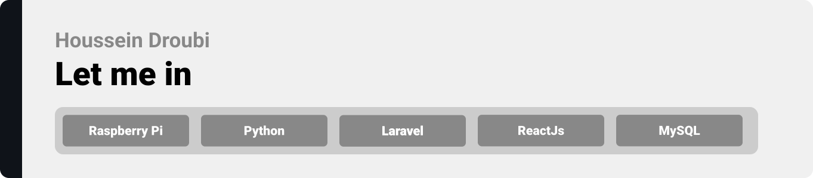

> Hello world! This is the project’s summary that describes the project plain and simple, limited to the space available. 


**[PROJECT PHILOSOPHY](https://github.com/HousseinDroubi/let-me-in#-project-philosophy) • [WIREFRAMES](https://github.com/HousseinDroubi/let-me-in#-wireframes) • [TECH STACK](https://github.com/HousseinDroubi/let-me-in#-tech-stack) • [IMPLEMENTATION](https://github.com/HousseinDroubi/let-me-in#impplementation) • [HOW TO RUN?](https://github.com/HousseinDroubi/let-me-in#-how-to-run)**

  