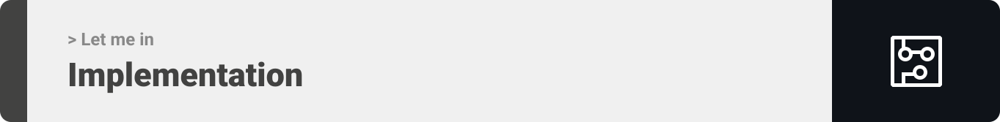

<div align="center">

> Hello world! This is the project’s summary that describes the project plain and simple, limited to the space available. 


**[PROJECT PHILOSOPHY](https://github.com/HousseinDroubi/let-me-in#project-philosophy) • [WIREFRAMES](https://github.com/HousseinDroubi/let-me-in#wireframes) • [TECH STACK](https://github.com/HousseinDroubi/let-me-in#tech-stack) • [IMPLEMENTATION](https://github.com/HousseinDroubi/let-me-in#implementation) • [HOW TO RUN?](https://github.com/HousseinDroubi/let-me-in#how-to-run)**

</div>

<br><br>


> Let me in system will open the barrier upon the approved list of license car plates the admin choose, just by taking a picture for the car plate number through the Pi camera. 
>
> In addition, the admin has the ability to add, edit and block users. Also, he can open/close the barrier permanently or until further notice.

### User Stories
- As a user, I want to know who enter and exit the parking, so that I can find them easily.
- As a user, I want to approve some of users, so that the barrier won't open for others.
- As a user, I want to get informed for new upcoming guests, so that I can either approve or reject them.

<br><br>


> This design was planned before on paper, then moved to Figma app for the fine details.
Note that i didn't use any styling library or theme, all from scratch and using pure css modules

| Login  | Forgot Password  |
| -----------------| -----|
|  |  |

| Home  | All Users |
| -----------------| -----|
|  |  

| Add User  | Edit User |
| -----------------| -----|
|  |  

| Blocked List  | New Coming Car |
| -----------------| -----|
|  |  

| Edit Profile  | Change Password |
| -----------------| -----|
|  |  

<br><br>



Here's a brief high-level overview of the tech stack the Let me in system uses:

- This project uses the [Laravel Framework](https://laravel.com/). Laravel is a web application framework with expressive, elegant syntax.
- For the Database, MySQL was used.
- Let me in also uses the [React](https://reactjs.org/) library for the front-end. React makes it painless to create interactive UIs, is component-based and is reusable.
- For the hardware side, this project uses the [Raspberry Pi](https://www.raspberrypi.org/) and [Raspberry Pi 3 Model B+](https://www.raspberrypi.com/products/raspberry-pi-3-model-b-plus/) as a specific type. Raspberry Pi is a single board computer, which provides a set of GPIO (General Purpose Input/Ouput) pins, so, it allows you to control one or many electronic components for physical computing and explore the Internet of Things (IoT).
- [Python](https://www.python.org/) is the programming language used for the Pi. Python is an interpreted, object-oriented, high-level programming language with dynamic semantics.

<br><br>


> This is an example of how you may give instructions on setting up your project locally.
To get a local copy up and running follow these simple example steps.

### Prerequisites

This is an example of how to list things you need to use the software and how to install them.
* Download and Install [XAMPP](https://www.apachefriends.org/download.html)
* Download and Install [composer](https://getcomposer.org/Composer-Setup.exe)
* npm
```sh
npm install npm@latest -g
```
* For the hardware part:
    - Raspberry Pi 3 model B+
    - PiCamera
    - Stepper motor
    - L298N Motor Driver Module
    - IR Sensor
    - Power Supply DC 12V 1A
    - 3 resistors 330 ohm
    - Red led
    - Green led
    - Yellow led
    - Breadboard
    - Jumper wires
* On the Raspberry Pi, open the terminal:
```sh
pip3 install python-dotenv
```
