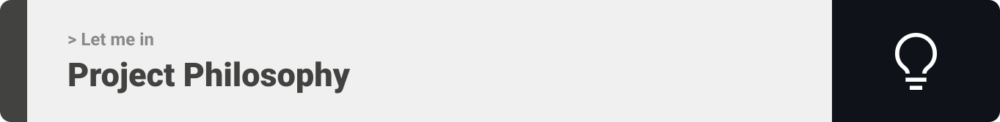
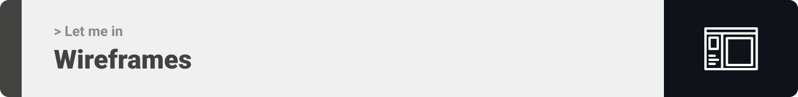

> Hello world! This is the project’s summary that describes the project plain and simple, limited to the space available. 


**[PROJECT PHILOSOPHY](https://github.com/HousseinDroubi/let-me-in#project-philosophy) • [WIREFRAMES](https://github.com/HousseinDroubi/let-me-in#wireframes) • [TECH STACK](https://github.com/HousseinDroubi/let-me-in#-tech-stack) • [IMPLEMENTATION](https://github.com/HousseinDroubi/let-me-in#impplementation) • [HOW TO RUN?](https://github.com/HousseinDroubi/let-me-in#-how-to-run)**

  

> Let me in system will open the barrier upon the approved list of license car plates the admin choose, just by taking a picture for the car plate number through the Pi camera. 
>
> In addition, the admin has the ability to add, edit and block users. Also, he can open/close the barrier permanently or until further notice.

### User Stories
- As a user, I want to know who enter and exit the parking, so that I can find them easily.
- As a user, I want to approve some of users, so that the barrier won't open for others.
- As a user, I want to get informed for new upcoming guests, so that I can either approve or reject them.

  

> This design was planned before on paper, then moved to Figma app for the fine details.
Note that i didn't use any styling library or theme, all from scratch and using pure css modules

| Login  | Forgot Password  |
| -----------------| -----|
|  |  |

| Home  | All Users |
| -----------------| -----|
|  |  

| Add User  | Edit User |
| -----------------| -----|
|  |  

| Blocked List  | New Coming Car |
| -----------------| -----|
|  |  

| Edit Profile  | Change Password |
| -----------------| -----|
|  |  

