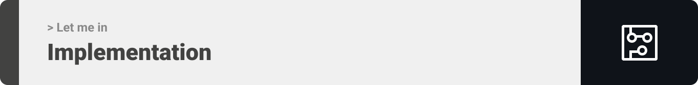

<div align="center">

> Hello world! This is the project’s summary that describes the project plain and simple, limited to the space available.

**[PROJECT PHILOSOPHY](https://github.com/HousseinDroubi/let-me-in#project-philosophy) • [TECH STACK](https://github.com/HousseinDroubi/let-me-in#tech-stack) • [IMPLEMENTATION](https://github.com/HousseinDroubi/let-me-in#implementation) • [HOW TO RUN?](https://github.com/HousseinDroubi/let-me-in#how-to-run)**

</div>

<br><br>


> Let me in system will open the barrier upon the approved list of license car plates the admin choose, just by taking a picture for the car plate number through the Pi camera.
>
> In addition, the admin has the ability to add, edit and block users. Also, he can open/close the barrier permanently or until further notice.

### User Stories

- As a user, I want to know who enter and exit the parking, so that I can find them easily.
- As a user, I want to approve some of users, so that the barrier won't open for others.
- As a user, I want to get informed for new upcoming guests, so that I can either approve or reject them.

<br>


Here's a brief high-level overview of the tech stack the Let me in system uses:

- This project uses the Laravel Framework. Laravel is a web application framework with expressive, elegant syntax.
- For the Database, MySQL was used.
- Let me in also uses the React library for the front-end. React makes it painless to create interactive UIs, is component-based and is reusable.
- For the hardware side, this project uses the Raspberry Pi. Raspberry Pi is a single board computer, which provides a set of GPIO (General Purpose Input/Ouput) pins, so, it allows you to control one or many electronic components for physical computing and explore the Internet of Things (IoT).
- Python is the programming language used for the Pi. Python is an interpreted, object-oriented, high-level programming language with dynamic semantics.

<br><br>



> Using the above mentioned tech stacks and the wireframes built with figma from the user stories we have, the implementation of the app is shown as below, these are gifs from the real app.

<div align="center">

| Open the Barrier                                       |
| ------------------------------------------------------ |
|  |

| Close the Barrier                                       |
| ------------------------------------------------------- |
|  |

| Return to Initial State                                    |
| ---------------------------------------------------------- |
|  |

| User in the Accepted List                               |
| ------------------------------------------------------- |
|  |

| User in the Blocked List                                |
| ------------------------------------------------------- |
|  |

| Accept New User                                           |
| --------------------------------------------------------- |
|  |

| Reject New User                                           |
| --------------------------------------------------------- |
|  |

| Forgot Password                                           |
| --------------------------------------------------------- |
|  |

</div>

<br>


> This is an example of how you may give instructions on setting up your project locally.
> To get a local copy up and running follow these simple example steps.

### Prerequisites

This is an example of how to list things you need to use the software and how to install them.

- Download and Install XAMPP
- Download and Install composer
- Download and Install Tesseract OCR
- Download and Install Python
- npm

```sh
npm install npm@latest -g
```

- Now open the environment variables and add python and tesseract ocr to the path.

- Open your cmd and download using pip as following:

```sh
pip install pytesseract
```

```sh
pip install pillow opencv-python
```

```sh
pip install python-dotenv
```

- For the hardware part:
  - Raspberry Pi 3 model B+
  - PiCamera
  - Stepper motor
  - L298N Motor Driver Module
  - IR Sensor
  - Power Supply DC 12V 1A
  - 3 resistors 330 ohm
  - Red led
  - Green led
  - Yellow led
  - Breadboard
  - Jumper wires
- On the Raspberry Pi, open the terminal:

```sh
pip3 install python-dotenv
```

### Installation

_Below is an example of how you can instruct your audience on installing and setting up your app._

Starting with the backend:

1. Clone the repo:

```sh
git clone https://github.com/HousseinDroubi/let-me-in
```

2. Open your XAMPP control panel and start Apache and MySQL

3. Go to backend

```sh
cd backend
```

4. Rename the .env.example file to .env and specify your database name

5. Turn on 2-Step Verification on your email

```sh
manage your google account->security->turn on 2-Step Verification
```

6. At the same page, create App passwords

```sh
manage your google account->security->App passwords
```

7. Copy the app password, and go back to .env file and fill the following:

```sh
MAIL_MAILER=smtp
MAIL_HOST=smtp.gmail.com
MAIL_PORT=465
MAIL_USERNAME='Your email'
MAIL_PASSWORD='The password you just copied'
MAIL_ENCRYPTION=null
MAIL_FROM_ADDRESS="Your email"
MAIL_FROM_NAME="${APP_NAME}"
```

8. Migrate the database schema

```sh
   php artisan migrate
```

9. Generate a new JWT secret key:

```sh
php artisan jwt:secret
```

10. Install the dependencies

```sh
composer install
```

11. Open the cmd and copy the IPv4

```sh
ipconfig
```

12. Go back and launch the server

```sh
php artisan serve --host your IPv4 --port 8000
```

13. Using an api tester such as thunder client in VScode:

- Create an account for the admin and another one for the Raspberry Pi using 'register' route
- Create one row into the table barrier_statuses
- Login for the Raspberry Pi (second email you created for it) using 'login' route, and copy the 'access_token'

14. Now go to the Raspberry Pi, and clone the repo (same step #1)

15. Rename the .env.example file to .env and past the 'access_token' from the api tester you have used into MY_TOKEN

16. Remove 'your IPv4' and replace the IPv4 of your access point (same as step #11). But, be carefull, the Raspberry Pi and your pc must be connected to the same access point

17. Now, we have to connect the circuit as below:
    

18. Now to get the front-end get running, go into the front-end folder in a new terminal

```sh
   cd frontend
```

19. Install the dependencies

```sh
npm install
```

20. Rename .env.example to .env

21. From .env remove your IPv4 and put your own IPv4.

22. Start the application

```sh
npm start
```
